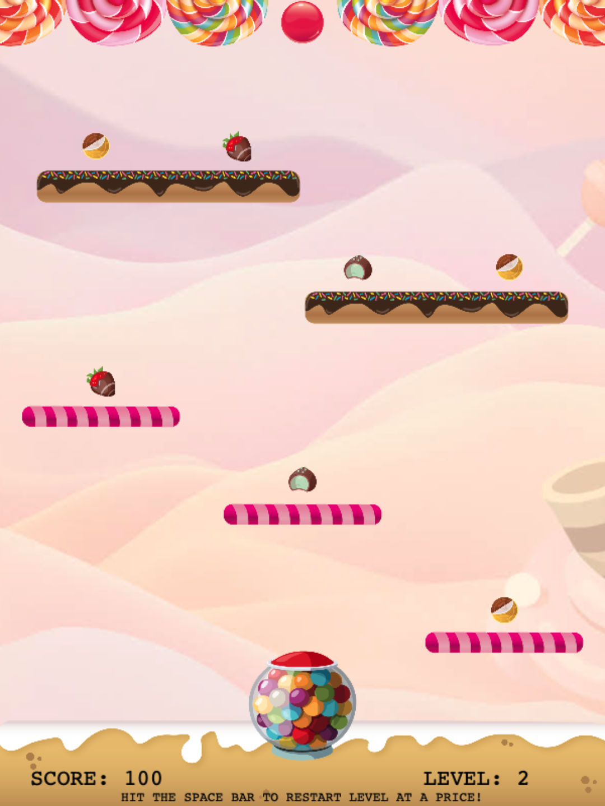

# GumBall

## Objective
---
Shoot the Gum Ball and pass through the obstacles collecting as many prize sweets as you can for points.

The level is over when you reach the top.

## Demo
---
https://cartiles0.github.io/bouncy/

## Rules
---
Move the pointer on top of the game to active the pointer move in the cannon. When you have chosen the angle click to shoot the ball.

The ball has a drag, it will eventually stop at which point the level will restart.

Hit the space bar to reset the level.

If you are passed level1 and the level restarts by the ball stopping or spacebar, 30 points will be deducted off your total score.

If you have less than 0 points you loose.

## Notes
---
This is a game still in development, I will updates as more features are added.

Things in the works.

- More levels
- Different obstacles
- Multiplayer option

This game is being developed using Phaser 3

## Credits
---
- GitHub
- Phaser.io Phaser 3 version
- Reboot Academy
